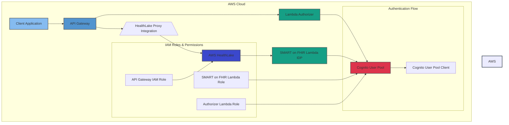

# HealthLake CDK

This project deploys an AWS HealthLake FHIR API with authentication using Amazon Cognito.



## Prerequisites

- AWS CDK installed
- Node.js and npm installed
- AWS CLI configured with appropriate credentials


## Deployment

To deploy the stack:

```bash
npm install

AUTH_DOMAIN_NAME=auth.mydomain.com API_DOMAIN_NAME=api.mydomain.com HOSTED_ZONE_NAME=mydomain.com HOSTED_ZONE_ID=Z09773219GD7CGO9RMZF cdk deploy CognitoCertificateStack

# with the output of the previous deploy
AUTH_DOMAIN_NAME=auth.mydomain.com API_DOMAIN_NAME=api.mydomain.com HOSTED_ZONE_NAME=mydomain.com HOSTED_ZONE_ID=Z09773219GD7CGO9RMZF COGNITO_CERTIFICATE_ARN=arn:aws:acm:us-east-1:338756015813:certificate/981bb57d-63e1-1234-b863-0205b1a6695b cdk deploy TestHealthlakeCdkStack
```

After deployment, note the outputs:
- ApiUrl: The API Gateway endpoint URL
- UserPoolId: The Cognito User Pool ID
- UserPoolClientId: The Cognito App Client ID

## Using the HealthLake API Client

The repository includes a shell script to interact with the API using only curl commands.

### Setup

1. Make the script executable:
   ```bash
   chmod +x scripts/healthlake-api.sh
   ```

2. Run the script with the required parameters from the CDK outputs:
   ```bash
   ./scripts/healthlake-api.sh <api-url> <user-pool-id> <client-id>
   ```

### Features

The script provides the following functionality:
- User signup with email verification
- User login with JWT token retrieval
- Listing patients from the HealthLake FHIR datastore

### Example Usage

```bash
# Run the script with your deployment parameters
./scripts/healthlake-api.sh https://api.mydomain.com us-east-1_abcdefg 1abc2defghij3klmno4pqr5st

# Follow the interactive menu to:
# 1. Sign up
# 2. Log in
# 3. List patients
# 4. Create patient
# 5. Get patient by ID
# 6. Create observation
# 7. List observations for a patient
# 8. Exit
```

## Security Considerations

- The script stores tokens in your home directory. For production use, implement a more secure storage solution.
- Use AWS SecretManager to store credentials
- Ensure the API Gateway and Cognito User Pool have appropriate security configurations.
- Review IAM roles and policies to adhere to the principle of least privilege.

## Useful commands

* `npm run build`   compile typescript to js
* `npm run watch`   watch for changes and compile
* `npm run test`    perform the jest unit tests
* `npx cdk deploy`  deploy this stack to your default AWS account/region
* `npx cdk diff`    compare deployed stack with current state
* `npx cdk synth`   emits the synthesized CloudFormation template
